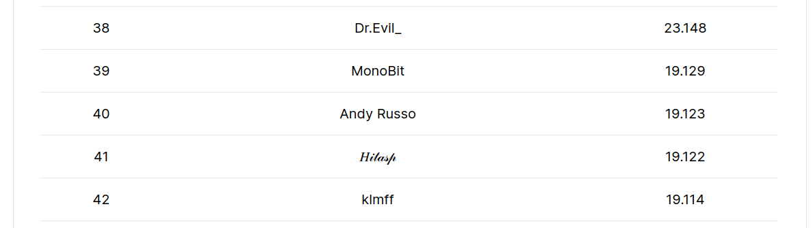

# My solutions for TSC5
This repository contains my solutions to tasks 1-3 and task 4 basic version.  
I did not solve the advanced version of task 4 in time.  
Solved tasks are commented as much as reasonable to explain every weird/advanced detail that happens there, or task description confusions.  
Additionally, after the contest ended I "finished" the advanced version of task 4 by taking two crucial ideas from other contest participants' solutions.

Comments were added after the challenge ended, however the actual code has not been modified - this is my last submission (except task 4 advanced) resulting in the total `19.123` score on the [leaderboard](https://standings.tonsmartchallenge4.com). (hence why there're some unfixed quirks)  
Currently I take place #40.

Tasks 1-3 are self-contained, but I'd recommend reading through them with task's description open (for TL-Bs and general logic).  
For task 4 I recommended to read this file first.

My solutions' scores: ([as a screenshot](evaluation_results.png))

|    Task    |   Gas used    |      Score       |
|:----------:|:-------------:|:----------------:|
| 1          | 124,545,189   | 5.3758           |
| 2          | 2,405,364,153 | 5.3528           |
| 3          | 256,466,320   | 5.3945           |
| 4 Advanced | 13,077,612    | 0 (11/12 tests)  |
| 4 Basic    | 4,634,208     | 3.0000           |

**Additional information about the contest and the original repository: https://github.com/ton-community/tsc5**

## Task 4
### Common things
I've decided to use the A* (A-star) path finding algorithm. From my limited research, A* just seemed like the best option, and it seems to be the standard one too.  
In code, I call the "F cost" the "Final cost" for clarity.  
I call a node a single position in the maze (`Node` will refer to a "type" that I define later).  
Open list is coordinates that need to be expanded and looked for their neighbors, and closed list are already expanded ones (formatted `open` and `closed` will refer to actual variables).  
These resources really helped me understand how A* works and gave me an idea on how to implement it:
- https://youtu.be/ySN5Wnu88nE (concept)
- https://youtu.be/-L-WgKMFuhE (more detailed concept and pseudo code that I based on)
- https://theory.stanford.edu/~amitp/GameProgramming/Heuristics.html (heuristics information)
- https://youtu.be/3Dw5d7PlcTM (optimization with a heap)

As per the heuristic, from the examples it can be seen that diagonal moves have the same cost as straight ones.  
That means for this task the appropriate heuristic is [Chebyshev distance](https://wikipedia.org/wiki/Chebyshev_distance).

### Basic version
Basic version implemented the A* algorithm, with open list being a lisp-style-list, and closed list being a matrix (tuple of tuples of values).  
Entire solution was based around a `Node` - a tuple with certain values at certain indexes.  
The `Node` has:
<ol start="0">
    <li>X position</li>
    <li>Y position</li>
    <li>G cost</li>
    <li>Final cost</li>
    <li>Parent <code>Node</code></li>
</ol>

The open list contains `Node`s and the closed nodes in the closed list were also `Node`s.  
The parent `Node` is stored to easily recover the path at the end of the algorithm - recursively looking up each `Node`'s parent until the start is reached.

Before moving on to the advanced version I tried to optimize the basic version as much as I could.  
Open list was implemented as a lisp-style-list because it saved some gas compared to a regular tuple.  
Initially the closed list also was simply a tuple, but then I had the idea of having it as a matrix (tuple of tuples of values) instead of a regular tuple, to reduce the read cost from O(n) to O(1).  
Instead of iterating through the entire tuple, there only ever needs to be 2 `at()` calls to access the data on certain coordinates.  
The closed list is initialized as a copy of the maze (tuple of tuple of ints), so when looking up coordinates in it, values needs to be checked if they're a tuple - which means that this coordinate has been closed and a `Node` placed.  
This check is needed when expanding neighbors to not process closed coordinates repeatedly.

To satisfy the requirement of passing through a minimal amount of superpositions, superpositions have an increased G cost compared to free spaces or the exit.  
This makes the algorithm first look through free or exit nodes, until it doesn't have any other nodes but superpositions to explore.

This is all the interesting parts for this solution, the rest is just A*. The [`task4_basic.fc`](task4_basic.fc) contains the code and some additional comments.

### Advanced version
The implementation for advanced version would not differ much for A*. Obstacles are now declared waklable with a very high G cost.  
Getting 11/12 tests was easy, but second change of the advanced version is that mazes can now be up to 31x31 in size.  
Proper optimization is now required to execute within the gas limit.  
Generally, the most inefficient part of the A* algorithm is looking up the node with the lowest cost in the open list.  
Implementing some sort of [priority queue](https://wikipedia.org/wiki/Priority_queue) helps. In my previous implementation I was iterating through the entire list (refer to the [optimization video](https://youtu.be/3Dw5d7PlcTM) for more info).

That's the task, now about me.  
Unfortunately I could not come up with a good priority queue with the time I had left.  
First I attempted a tuple-based [heap](https://wikipedia.org/wiki/Heap_(data_structure)), which is basically a priority queue implementation via arrays.  
But tuples have a limit of 255 elements, so it overflowed and didn't work for this task.  
Then I tried using a dict-based priority queue, which used Final cost as key and serialized `Node` as value, but it had many issues which made it inefficient and complex so I couldn't implement it in time.  
I won't publish my failed implementations.

After the deadline I looked at two other solutions to complete my solution:
- A good priority queue implementation. Taken from [Mip182's solution](https://github.com/Mip182/tcs5).
- One major optimization with the algorithm. Taken from [justdmitry's solution](https://github.com/justdmitry/tsc5).

Second solution's idea is storing Final costs of every explored node in a matrix.  
This is a major optimization, because there is no more need to have random access on the `open` priority queue (for replacing old nodes with a better path), and basically removes the conventional A* closed list.  
Removing random access allows to use the great dict-based priority queue implementation from [Mip182's solution](https://github.com/Mip182/tcs5).  

The `closed` matrix is repurposed to store Final costs, which is more efficient than using `Node`s (because there is no need for extra operations to read the cost).  
The matrix is initialized with a bigger-than-achievable Final cost, which marks unexplored nodes, start node is marked with 0 (`closed` now is a tuple of tuples of ints).  
Speaking of `Node`s, this optimization completely eliminates them.

This fits with the rest of the implementation.  
In the previous implementation, when iterating through neighbors, they are checked if the neighbor's Final cost is lower than that of a possible existing node in the open list.  
But in this implementation, when neighbors are explored, they just won't be pushed to the priority queue if their Final cost is higher or equal to the cost in the `closed` matrix.  
This also means that explored for the first time nodes will always be pushed.

Recovering the path is also simple - look at the neighbors of the end node and pick one with the lowest Final cost (in case of identical Final costs pick lower G cost), repeat until the start is found.  
To summarize: this optimization makes the algorithm more streamlined and much cheaper.  

Additional technical explanations are added in the source file's comments: [`task4.fc`](task4.fc).

#### Benchmark
Two benchmarks of my finalized advanced task 4 solution.

Benchmark on a predefined maze: 15520227 gas.

S|X|.|X|.|X|.|X|.|X|.|X|.|X|.|X|.|X|.|X|.|X|.|.|.|.|.|.|.|.|.
-|-|-|-|-|-|-|-|-|-|-|-|-|-|-|-|-|-|-|-|-|-|-|-|-|-|-|-|-|-|-
.|X|.|X|.|X|.|X|.|X|.|X|.|X|.|X|.|X|.|X|.|X|.|.|.|.|.|.|.|.|.
.|X|.|X|.|X|.|X|.|X|.|X|.|X|.|X|.|X|.|X|.|X|.|.|.|.|.|.|.|.|.
.|X|.|X|.|X|.|X|.|X|.|X|.|X|.|X|.|X|.|X|.|X|.|.|.|.|.|.|.|.|.
.|X|.|X|.|X|.|X|.|X|.|X|.|X|.|X|.|X|.|X|.|X|.|.|.|.|.|.|.|.|.
.|X|.|X|.|X|.|X|.|X|.|X|.|X|.|X|.|X|.|X|.|X|.|.|.|.|.|.|.|.|.
.|X|.|X|.|X|.|X|.|X|.|X|.|X|.|X|.|X|.|X|.|X|.|.|.|.|.|.|.|.|.
.|X|.|X|.|X|.|X|.|X|.|X|.|X|.|X|.|X|.|X|.|X|.|.|.|.|.|.|.|.|.
.|X|.|X|.|X|.|X|.|X|.|X|.|X|.|X|.|X|.|X|.|X|.|.|.|.|.|.|.|.|.
.|X|.|X|.|X|.|X|.|X|.|X|.|X|.|X|.|X|.|X|.|X|.|.|.|.|.|.|.|.|.
.|X|.|X|.|X|.|X|.|X|.|X|.|X|.|X|.|X|.|X|.|X|.|.|.|.|.|.|.|.|.
.|X|.|X|.|X|.|X|.|X|.|X|.|X|.|X|.|X|.|X|.|X|.|.|.|.|.|.|.|.|.
.|X|.|X|.|X|.|X|.|X|.|X|.|X|.|X|.|X|.|X|.|X|.|X|.|.|.|.|.|.|.
.|X|.|X|.|X|.|X|.|X|.|X|.|X|.|X|.|X|.|X|.|X|.|X|.|.|.|.|.|.|.
.|X|.|X|.|X|.|X|.|X|.|X|.|X|.|X|.|X|.|X|.|X|.|X|.|.|.|.|.|.|.
.|X|.|X|.|X|.|X|.|X|.|X|.|X|.|X|.|X|.|X|.|X|.|X|.|.|.|.|.|.|.
.|X|.|X|.|X|.|X|.|X|.|X|.|X|.|X|.|X|.|X|.|X|.|X|.|.|.|.|.|.|.
.|X|.|X|.|X|.|X|.|X|.|X|.|X|.|X|.|X|.|X|.|X|.|X|.|.|.|.|.|.|.
.|X|.|X|.|X|.|X|.|X|.|X|.|X|.|X|.|X|.|X|.|X|.|X|.|.|.|.|.|.|.
.|X|.|X|.|X|.|X|.|X|.|X|.|X|.|X|.|X|.|X|.|X|.|X|.|.|.|.|.|.|.
.|X|.|X|.|X|.|X|.|X|.|X|.|X|.|X|.|X|.|X|.|X|.|X|.|.|.|.|.|.|.
.|X|.|X|.|X|.|X|.|X|.|X|.|X|.|X|.|X|.|X|.|X|.|X|.|.|.|.|.|.|.
.|X|.|X|.|X|.|X|.|X|.|X|.|X|.|X|.|X|.|X|.|X|.|X|.|.|.|.|.|.|.
.|X|.|X|.|X|.|X|.|X|.|X|.|X|.|X|.|X|.|X|.|X|.|X|.|.|.|.|.|.|.
.|X|.|X|.|X|.|X|.|X|.|X|.|X|.|X|.|X|.|X|.|X|.|X|.|.|.|.|.|.|.
.|X|.|X|.|X|.|X|.|X|.|X|.|X|.|X|.|X|.|X|.|X|.|X|.|.|.|.|.|.|.
.|X|.|X|.|X|.|X|.|X|.|X|.|X|.|X|.|X|.|X|.|X|.|X|.|.|.|.|.|.|.
.|X|.|X|.|X|.|X|.|X|.|X|.|X|.|X|.|X|.|X|.|X|.|X|.|.|.|.|.|.|.
.|X|.|X|.|X|.|X|.|X|.|X|.|X|.|X|.|X|.|X|.|X|.|X|.|.|.|.|.|.|.
.|X|.|X|.|X|.|X|.|X|.|X|.|X|.|X|.|X|.|X|.|X|.|X|.|.|.|.|.|.|.
.|X|.|X|.|X|.|X|.|X|.|X|.|X|.|X|.|X|.|X|.|X|.|X|.|.|.|.|.|.|E

Randomly generated 31x31 maze with start and end in opposite corners, scores in gas units across 30 runs:
- Range: 5435833-20216649
- Median: 14134076
- Average: 13695833

Full gas usage of the 30 runs can be seen in [`benchmark.txt`](benchmark.txt).

